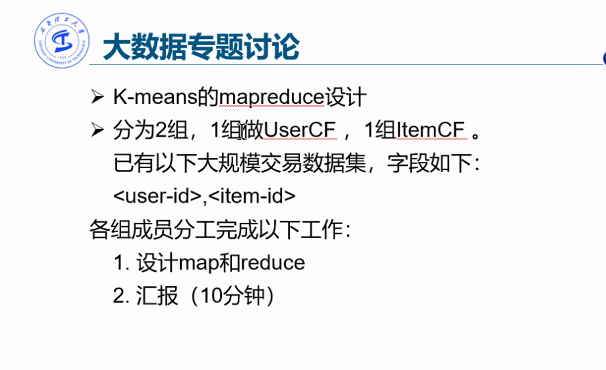

#### 知识表示和推理

#### 人工神经网络

模仿生物神经网络的计算机模型

###### 前馈神经网络

信息在一个方向上移动

> 结构:  输入层 + 隐藏层 + 输出层

###### 循环神经网络

加入了时间概念的前馈神经网络 , 某一时刻的某层的数据与前一时刻的对应层的数据相关

误差 : 预期输出和实际输出之间的差别

##### 卷积神经网络

局部连接, 权值共享, 三维排列 , 是前馈神经网络的一种

定义卷积核的方式:

* 传统人工定义卷积核
* 深度学习生成卷积核

###### 常用的卷积网络模型

也就是多少层网络, 每层多少个神经元 , 每个神经元的卷积核是什么 , 这些网络的执行先后顺序

###### 利用卷积神经网络进行模式识别 

1. 利用卷积神经网络将图片大小压缩至只剩特征矩阵
2. 选择一个深度学习的训练结果库作为初始模型库 , 自己在这个基础上再进行训练
3. 使用上一步自己训练的结果库去查找训练出来的特征矩阵对应的是什么东西
4. 返回这个匹配的东西

##### 深度学习平台

caffe

----

作业 : 

查阅 BP 和 SGD , 查阅学术文献做汇报

(人工智能花书)

----

#### 膜计算

新型的计算机中并行的多核的计算模型

----

#### 计算机视觉

###### 计算机视觉处理的问题

1. 分类

2. 目标识别 

3. 行为识别

识别视频中的行为.

处理流程 : 剪切视频 > 行为表达(行为表达分为手工特征和深度网络) > 分类器 > 分类结果

> 手工特征的分类
>
> 1. 全局特征 , 对于变化或复杂的背景表现不佳
> 2. 局部特征

>  行为识别的方式:
>
> * 使用3d 卷积神经网络
> * 使用光流作为输入来表达运动
> * 通过将帧信息融合来提取时空特征

4. 目标检测 : 将目标识别并框出来

   目标检测的方法 :

    1. 两步检测

    2. 单阶段检测

    3. 基于深度特征的方法 - RCNN

       > 步骤:
       >
       > 1. 根据相似度将图像中相似的部分框选出来
       > 2. 对每一个候选框使用卷积神经网络提取一个特征向量
       > 3. 对于每一个候选框的特征向量, 使用SVM进行分类 , 然后调整目标框的大小

   	4. 基于深度特征的方法 - fast RCNN

       > 和RCNN不同的是, 全图进行卷积 , 不使用SVM而是对框进行回归来调整框的大小

   	5. 基于深度特征的方法 - faster RCNN

       > 先对图形提取特征 , 在深度特征图像上使用锚点和固定大小进行目标框的选择 

5. 行为检测

   在视频中识别动作并检测出该动作发生的时间段

   > 行为检测的方法:
   >
   > 1. 视频帧分割识别
   > 2. 单次检测
   > 3. 时域推荐
   > 4. 3d卷积神经网络

reNet 残差网络

denseNet 密集网络

空洞卷积: 使用更大的卷积核来获取更广范围上的特征

特征叠加网络 : 将各个尺度的特征值相互叠加 , 从而保留更多的特征

计算机视觉的应用

1. 静脉识别
2. 航空小目标识别
3. 图像复原
4. 视频行为识别
5. 船只检索

作业: 专题报告+精读报告

#### 大数据

##### HDFS 

分布式文件系统, 是 GFS 的开源实现

系统节点分为名称节点和数据节点 , 名称节点存数据节点信息 , 数据节点存数据

HDFS可通过客户端或者java API 来访问管理

使用流程 : 先访问名称节点, 然后访问对应的数据节点

##### HBase

分布式数据库 , 面向半结构化数据进行存储 , 是列族数据库

* 将数据存储为字符串 , 没有数据类型
* 表之间不存在复杂的关系
* 存储模式 : 基于列存储
* 索引 : 只有一个索引, 行键
* 数据维护 : 更新操作时不会删除旧值, 而是重新创建一个新的数据
* 扩展性高, 容易对列进行扩展

##### MapReduce

计算向数据靠拢, 数据就近在处理节点上处理然后汇总结果

* 计算流程 : map -> shuffle -> reduce

##### 推荐系统

从海量数据中分析用户兴趣进而推荐信息.

热门商品 : 通用的商品推荐

长尾商品 : 用户的个性化需求

* 基于用户兴趣推荐
* 基于物品种类推荐

#### 智能机器人

###### 机器人的发展

1. 可编程机器人
2. 感知机器人, 对外界拥有反馈能力
3. 智能机器人, 融入了人工智能, 使其具有思考,学习和推理的能力

###### 机器人的视觉

视觉系统

1. 图像获取
2. 图像处理
3. 图像输出

视觉系统具体构成

1. 视觉传感器

   视觉传感器获取电信号, 然后电信号转为数字信号, 生成像素图像 , 然后使用颜色过滤器上色

   在数据中加入深度信息可实现三维数据的获取, 深度信息的获取是通过自动调节焦距然后计算景深

2. 图像处理机 -> 计算机  

   处理传感器获取的数据 , 图像处理机是专门为了处理图像数据的机器

###### 机器人的触觉

